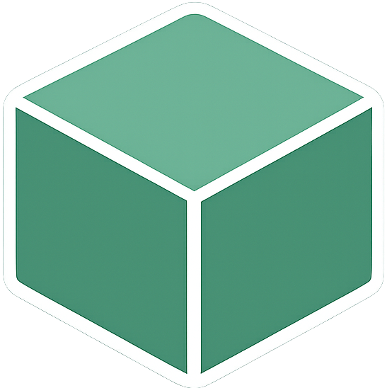

### 안녕하세요 개발자 Howarf입니다.
JavaScritp와 React를 중심으로 사용성을 중심으로 웹 서비스를 개발하고 있으며
새로운 기술을 배우거나 더 좋은 사용성을 위해 노력해나가는 중입니다.

  
  &nbsp;&nbsp;&nbsp;
  

## Tech Stack
### Frameworks & Languages

### backend & tool

